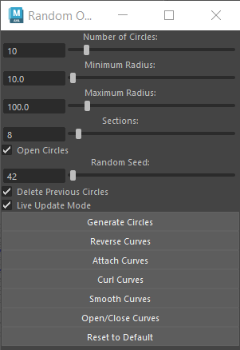

# Random Open Circles Generator

### Overview
The **Random Open Circles Generator** is a Python script for Autodesk Maya that generates randomized NURBS circles on selected polygon mesh surfaces. Users can control various parameters, including circle count, radius, sections, and whether the circles should be open or closed. The script also includes live update functionality for real-time adjustments.

### UI Preview


### Features
- Generate **randomized NURBS circles** aligned to surface normals and positioned randomly across polygon faces.
- Customizable parameters:
  - Number of circles
  - Minimum and maximum radius
  - Number of sections (4–100)
  - Random seed for reproducibility
  - Option to generate **open or closed** circles
- Integrated **Live Update Mode** for real-time adjustments.
- Curve management utilities:
  - Reverse curves
  - Attach curves
  - Open/Close curves
  - Smooth curves
  - Curl curves
- Reset parameters to default values with a single click.

### Important Notes
1. Maya's **Curl Curves** only works with curves that have **no history**.
2. Maya's **Curl Curves** and **Smooth Curves** may not work with **closed curves**.
3. If "Delete Previous Circles" is enabled, only **existing objects** will be deleted to prevent errors.
4. Live Update ensures that **no object remains selected** after adjusting parameters.

### Installation
1. Clone this repository:
   ```bash
   git clone https://github.com/hsuehyt/RandomOpenCirclesGenerator.git
   ```
2. Locate the script file:
   - `random_open_circles_generator.py`
3. Open Autodesk Maya.
4. Load the script in Maya:
   - Copy and paste the script into Maya's **Script Editor** and execute it.

### Usage
1. **Run the Script**:
   - Execute the script to open the user interface (UI).
2. **Select a Mesh**:
   - Choose a polygon mesh where you want the circles to be generated.
3. **Adjust Parameters**:
   - Set the number of circles, radius range, sections, and whether the circles should be open or closed.
4. **Generate Circles**:
   - Click the `Generate Circles` button to create the circles on the selected mesh.
5. **Use Curve Management Tools**:
   - Utilize buttons like `Reverse Curves`, `Attach Curves`, `Open/Close Curves`, `Curl Curves`, or `Smooth Curves` to manage generated curves.

### Buttons Description
- **Generate Circles**: Creates randomized NURBS circles based on the current settings.
- **Reverse Curves**: Opens Maya's `Reverse Curve Options` window to reverse the direction of selected curves.
- **Attach Curves**: Opens Maya's `Attach Curves Options`.
- **Open/Close Curves**: Opens Maya's `Open/Close Curve Options` window.
- **Curl Curves**: Opens Maya's `Curl Curves Options`.
- **Smooth Curves**: Opens Maya's `Smooth Curves Options`.
- **Reset to Default**: Resets all parameters to their default values.

### Requirements
- **Autodesk Maya 2023 or later**.
- **Python 2.7+** (integrated with Maya).

### License
This project is licensed under the **MIT License**. See the [LICENSE](LICENSE) file for details.

### Contribution
Feel free to submit **pull requests** or raise **issues** for enhancements or bug fixes. Contributions are welcome!

### Author
[Hsuehyt](https://github.com/hsuehyt)